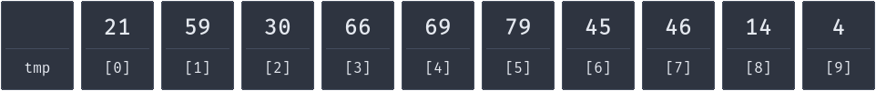

# sortsite

Sort a list just by comparing and moving values.

Click on two values to compare them. Drag values to a free spot to move them.
You can change the number of values or hide them.

_I'm currently working on step by step guides for different sorting algorithms.
See the `alg-guides` branch for progress._
